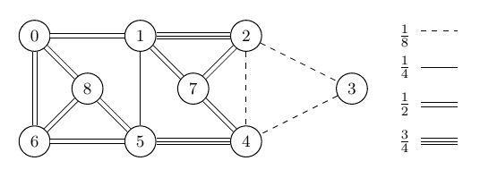

Example
=======
This example corresponds to the SEC separation problem derived from the graph of Figure 6 in the [paper](https://arxiv.org/pdf/2004.14574.pdf).

<div style="text-align:center"></div>

### Build the example

```sh
cd $BUILD
make install
```

You can build and run the example by:
```sh
gcc -o example example.c -lcpsrksec
./example
```
It is assumed that you have already configured, built and installed the library. Otherwise, follow the instructions in the project [README](../).

If you have used a different prefix when configuring the project, do not forget to append the shared library path to the LD_LIBRARY_PATH environment variable.
```sh
gcc -o example example.c -I$PREFIX/include/ -L$PREFIX/lib/ -lcpsrksec
export LD_LIBRARY_PATH=$LD_LIBRARY_PATH:$PREFIX/lib/
./example
```

Remember to append the new LD_LIBRARY_PATH to your bashrc file.

### Build with Libtool
If you want to make changes in the library code without installing the library system-wide every time you modify a file, use Libtool to compile the example.
```sh
libtool --mode=link gcc -o example  example.c -I../src ../build/src/libcpsrksec.la
```
Consider running the [experiments](../exp/), if you need a deeper testing.
